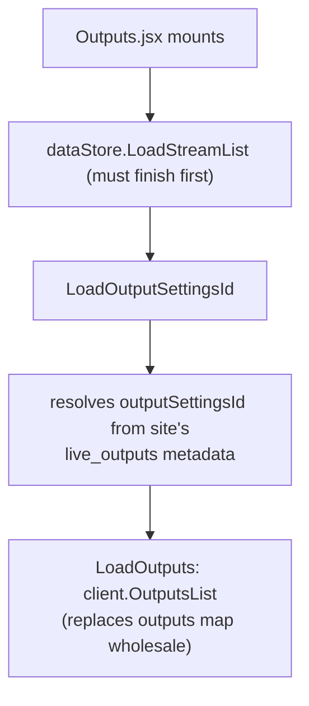
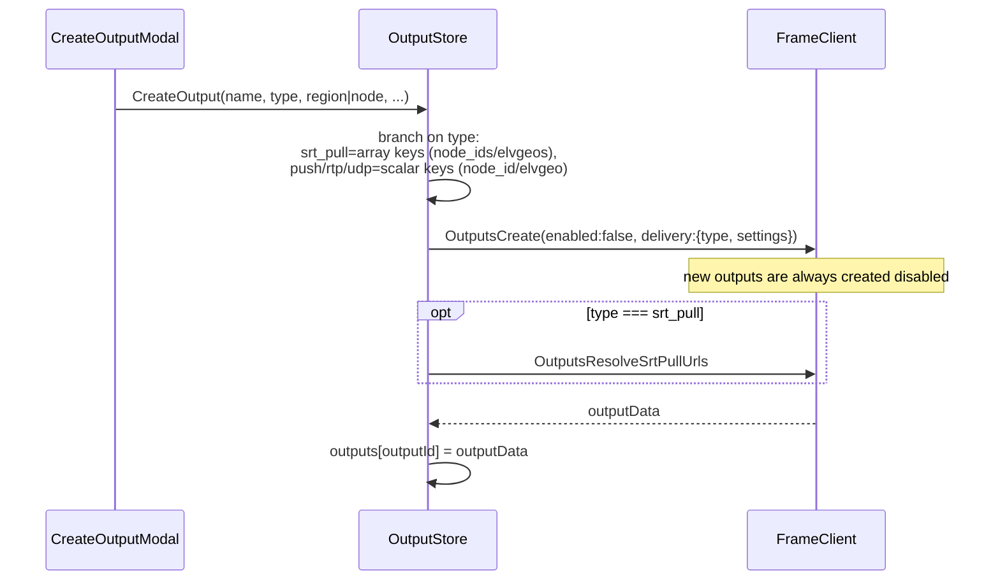
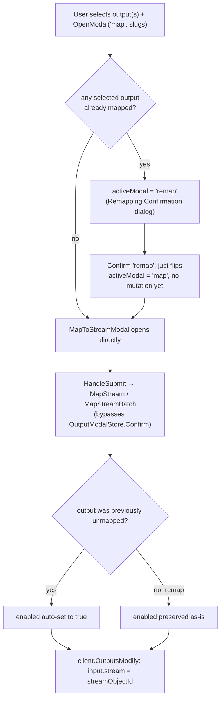
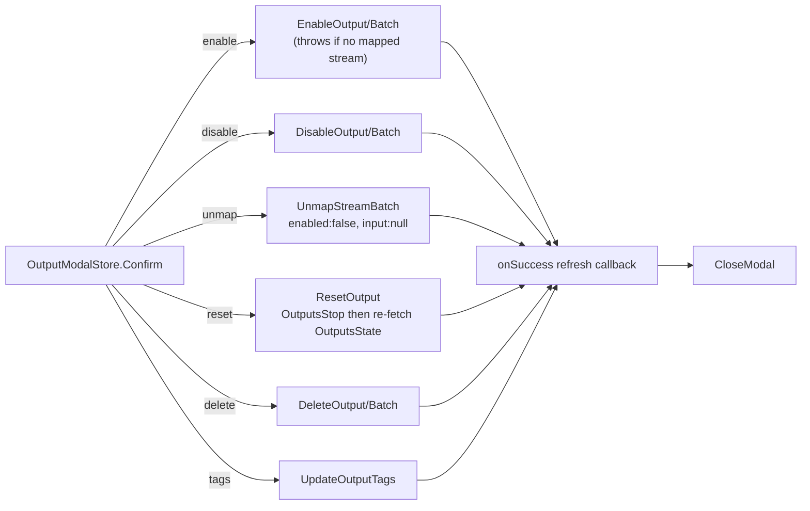
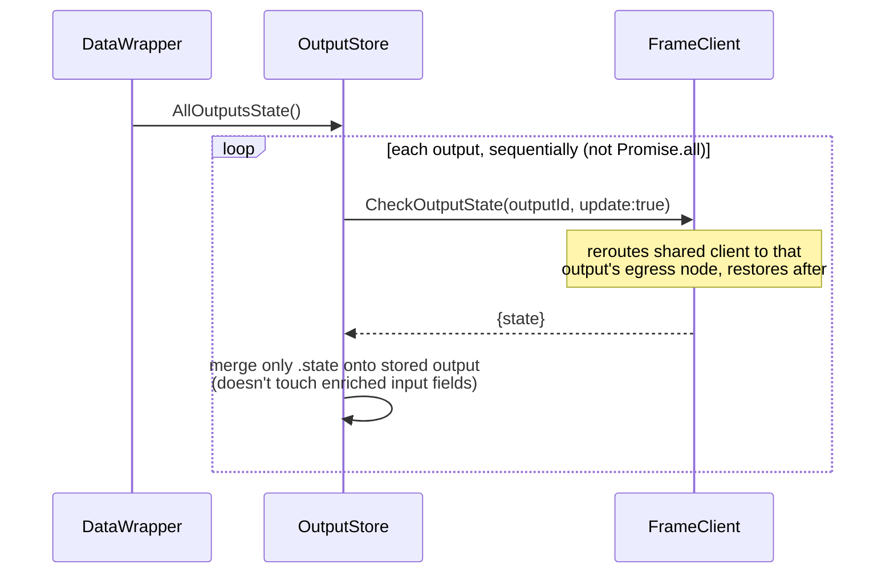

# Output lifecycle

An **output** is not itself a live stream — it's a separate fabric object (`live_outputs/<outputId>`, under a shared `outputSettingsId` content object) representing an egress destination (SRT pull, SRT push, RTP, or UDP) that gets **mapped** to one existing input stream and relays its output externally when enabled.

## Loading

`LoadOutputs` must run **after** `LoadStreamList` and never concurrently with output-state polling — `OutputsList`/`OutputsState` temporarily reroute the shared fabric client to a live-egress node; overlapping calls would mis-route each other's reads and 403.

## Creation

## Mapping a stream to an output

## Enable / disable / reset / delete / unmap

All routed through `OutputModalStore.Confirm`, which switches on `activeModal` to call the matching `OutputStore` method (single vs. batch variant chosen by `modalSlugs.length === 1`), then calls the caller-supplied `onSuccess` refresh callback and closes the modal.

On error, `OutputConfirmModal` shows a red notification but deliberately leaves the modal open (no auto-close on failure), so the user can retry or cancel explicitly.

## Status polling

Mirrors the stream-status loop, run from the same `DataWrapper` cycle, sequentially **after** `streamStore.AllStreamsStatus()`:

Per-output errors are caught individually so one failing output doesn't block refreshing the rest — unlike `LoadOutputs`, which is one all-or-nothing call used on page mount/manual refresh.

## Key files

- `src/stores/OutputStore.ts:218-256` — `LoadOutputSettingsId` / `LoadOutputs`
- `src/stores/OutputStore.ts:390-457` — `CreateOutput`
- `src/stores/OutputStore.ts:459-567` — `MapStream` / `MapStreamBatch`
- `src/stores/OutputStore.ts:569-617` — `UnmapStreamBatch`
- `src/stores/OutputStore.ts:683-851` — `EnableOutput`/`DisableOutput` (single + batch)
- `src/stores/OutputStore.ts:619-681` — `ModifyOutput`
- `src/stores/OutputStore.ts:926-954` — `ResetOutput`
- `src/stores/OutputStore.ts:853-891` — `DeleteOutput`/`DeleteOutputBatch`
- `src/stores/OutputStore.ts:263-310` — `CheckOutputState` / `AllOutputsState` (poll batch)
- `src/stores/OutputModalStore.ts:113-165` — `OpenModal` / `Confirm` orchestration, `MODAL_CONFIG`
- `src/components/data-wrapper/DataWrapper.jsx` — shared polling loop (see stream-lifecycle.md)