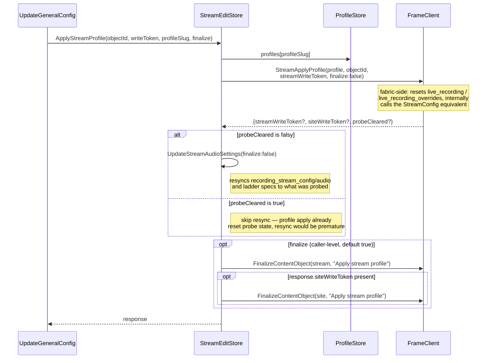
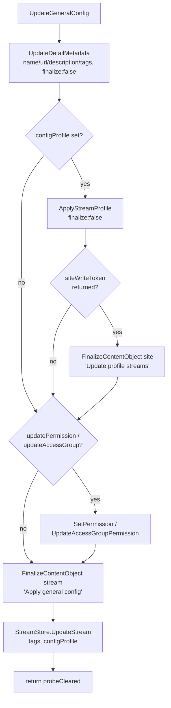

# Profile apply flow

Applying a profile to a stream is driven by `StreamEditStore.ApplyStreamProfile`, almost always via `UpdateGeneralConfig` (the General panel's Save path). The key branch is `probeCleared`, returned by the fabric-js `StreamApplyProfile` call, which decides whether the client needs to resync audio settings.

## `ApplyStreamProfile`

## Caller: `UpdateGeneralConfig` (General panel Save)

`ApplyStreamProfile` is called with `finalize: false` here, so the outer method controls the single combined commit.

Note: `probeCleared` returned from `UpdateGeneralConfig` is captured by `GeneralPanel.Save()` but not currently read further — the UI does not branch on it. Worth knowing if you're tracing "why didn't anything visibly change" on a profile apply.

## `ProfileStore` — where profiles come from

- `LoadProfiles()` — `client.StreamConfigProfiles({resolveLinks: true})` populates `profiles` (slug → profile, read-only "original") and seeds `drafts` (editable copies) as a shallow copy.
- `SaveProfiles()` writes each dirty draft via `client.StreamSaveConfigProfile`. On rename, it also migrates `public/asset_metadata/profile_streams/<oldSlug>` → `<newSlug>` on the site object — this is the `stream_profiles` mapping referenced in CLAUDE.md, and it must move atomically with the profile rename.
- `DeleteProfile(slug)` deletes both the `live_stream_profiles/<slug>.json` file and the `public/asset_metadata/profiles/<slug>` metadata.

`ApplyStreamProfile`'s `siteWriteToken` finalize step corresponds to `StreamApplyProfile` itself updating this same site-object profile↔stream bookkeeping fabric-side.

## Key files

- `src/stores/StreamEditStore.ts:1069-1122` — `ApplyStreamProfile`
- `src/stores/StreamEditStore.ts:921-1009` — `UpdateGeneralConfig` (primary caller)
- `src/stores/StreamEditStore.ts:1602-1639` — `UpdateStreamAudioSettings` fallback branch (reconstructs audio index from ladder specs when no probe data exists yet)
- `src/pages/streams/details/general/GeneralPanel.jsx:115-128` — `Save()`, where `probeCleared` is returned but unused
- `src/stores/ProfileStore.ts:33-46` — `LoadProfiles`
- `src/stores/ProfileStore.ts:110-190` — `SaveProfiles` (includes rename migration of `profile_streams`)
- `src/stores/ProfileStore.ts:69-102` — `DeleteProfile`