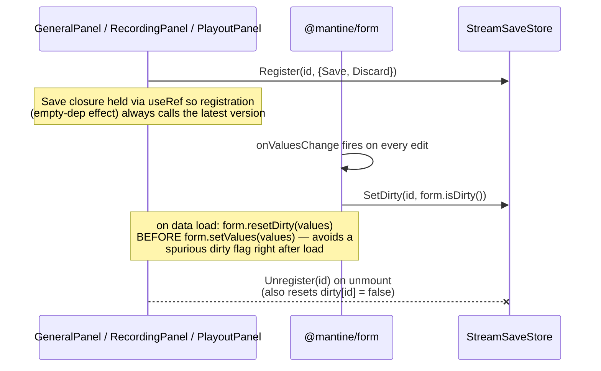
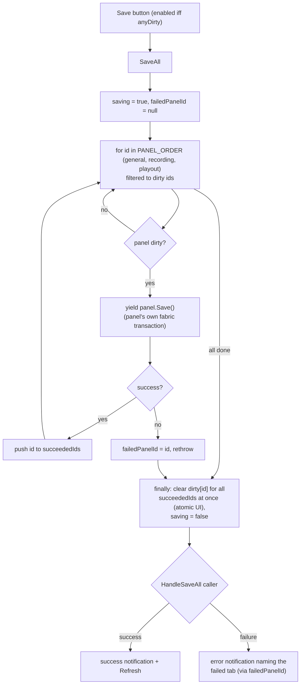
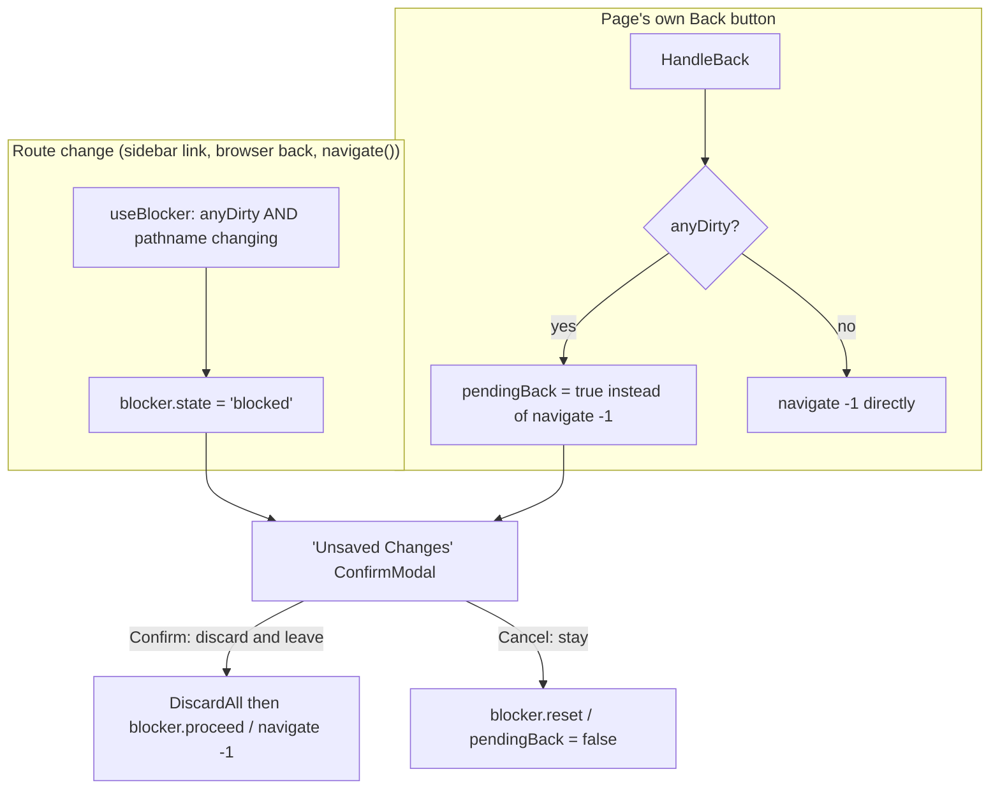

# Save/discard workflow

`StreamSaveStore` coordinates dirty tracking, Save, and Discard across the three savable tabs of the stream details page (General, Recording, Playout). It does **not** own form values — each panel keeps its own `@mantine/form` instance and just reports dirty/clean plus `Save`/`Discard` closures into the store.

## Registration (each panel, on mount)

`StreamDetailsPage` calls `StreamSaveStore.Reset()` on mount / when the stream id changes, clearing `panels`, `dirty`, `saving`, `failedPanelId` before reloading.

## Save flow

Saves are **sequential, not parallel**, and always in `general → recording → playout` order — because each panel does its own independent `EditContentObject`/`FinalizeContentObject` transaction, and stopping at the first failure leaves already-succeeded tabs clean while unattempted tabs stay dirty for retry.

## Discard flow

Discard is client-side only — no fabric calls. `Discard Changes` opens a confirm modal; on confirm, `DiscardAll()` iterates dirty panels, calls each panel's `Discard` (`form.reset()`), and clears their dirty flags synchronously.

## Blocking actions while dirty

Any stream action with `mutatesStream: true` (Check, Start, Stop, Delete, ...) is force-disabled with tooltip "Save or discard your changes to use stream controls" whenever `anyDirty` is true.

## Unsaved-changes navigation guard

The `Back` button pre-checks dirty state rather than letting the blocker intercept a POP navigation, because React Router can only block-then-revert a POP after it already started — a visibly slow round trip. In-page tab switches don't trigger the blocker at all since the pathname doesn't change; only actual route changes do.

## Key files

- `src/stores/StreamSaveStore.ts:9-23` — state shape (`panels`, `dirty`, `saving`, `failedPanelId`)
- `src/stores/StreamSaveStore.ts:42-60` — `Register` / `Unregister` / `Reset`
- `src/stores/StreamSaveStore.ts:71-93` — `SaveAll` (generator/flow, sequential by `PANEL_ORDER`)
- `src/stores/StreamSaveStore.ts:95-100` — `DiscardAll`
- `src/pages/streams/details/StreamDetailsPage.jsx:44-50` — `useBlocker` for route-change guard
- `src/pages/streams/details/StreamDetailsPage.jsx:93-132` — `HandleSaveAll` / `HandleDiscardAll` / `HandleBack`
- `src/pages/streams/details/StreamDetailsPage.jsx:138-147` — `mutatesStream` action disabling
- `src/pages/streams/details/StreamDetailsPage.jsx:269-302` — Discard and "Unsaved Changes" `ConfirmModal`s
- `src/pages/streams/details/general/GeneralPanel.jsx:59,86-92,109-142` — registration pattern (representative; same shape in Recording/Playout panels)

## Output details page

The output details page (`src/pages/outputs/details/OutputDetails.jsx`) mirrors this exact architecture via a separate `OutputSaveStore` (`src/stores/OutputSaveStore.ts`), currently coordinating a single savable tab (`generalConfig`). Same `Register`/`Unregister`/`SetDirty`/`SaveAll`/`DiscardAll` shape, same tab `Indicator` dot, same Save/Discard toolbar, same `useBlocker` + pre-checked `Back` button + `ConfirmModal` pair for the unsaved-changes guard, and the same `mutatesOutput`-flagged action disabling (Reset, Enable/Disable, Unmap/Map) while dirty.