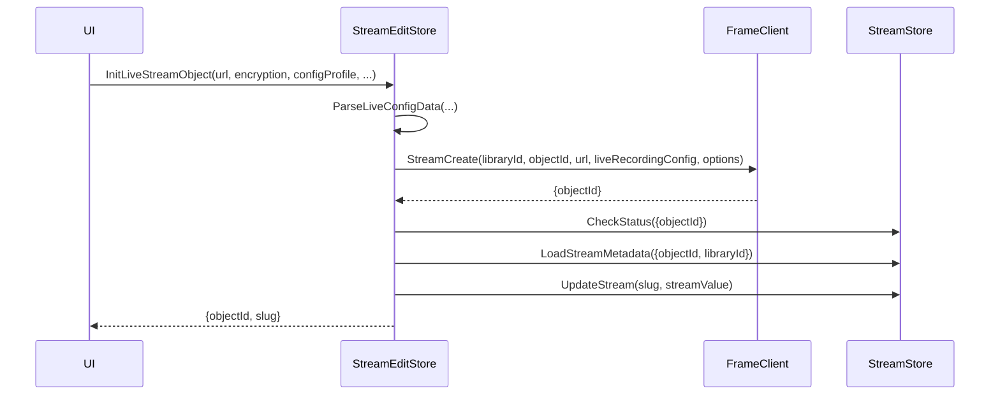
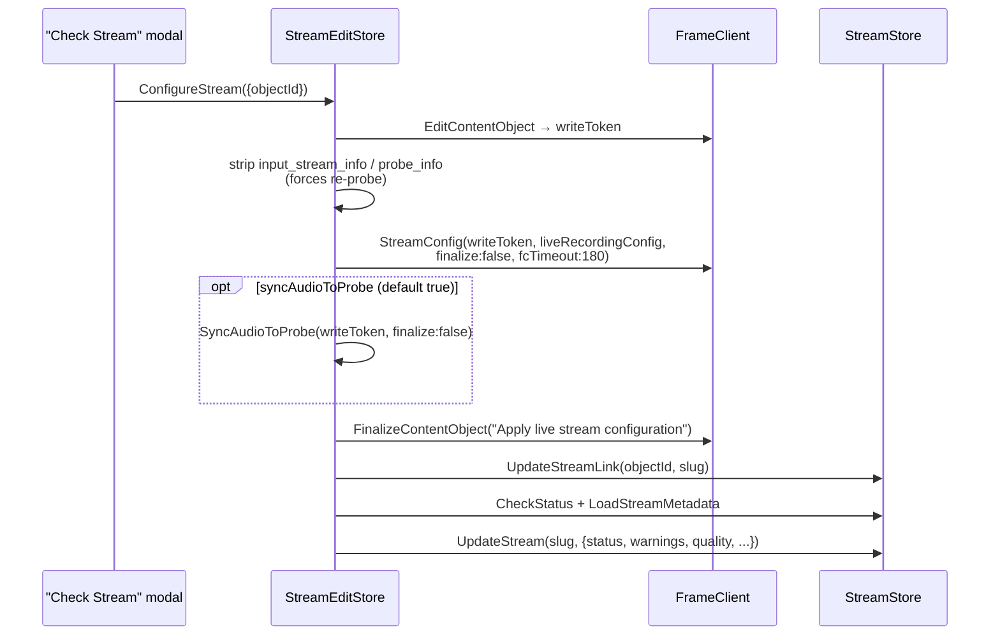
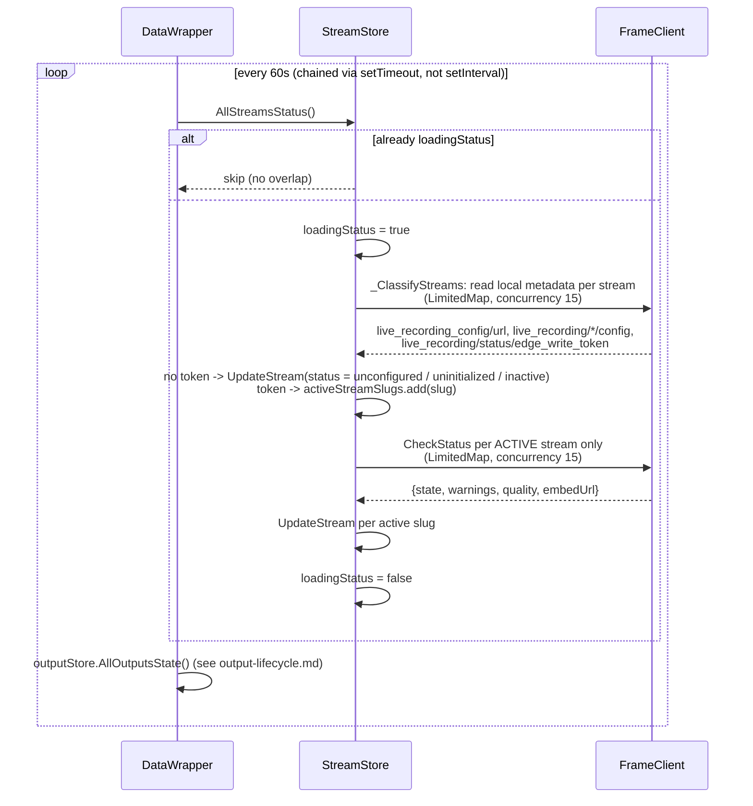

# Stream lifecycle

A stream is a content object on the Eluvio Fabric. This covers creation, configuration (probing), the start/stop/reset operations, and the background status-polling loop that keeps `StreamStore` in sync with fabric state.

## Creation



`DuplicateStream` is a variant: `CopyContentObject` → `CheckStatus` → `StreamCreate` (options only, no `liveRecordingConfig`) → `CheckStatus` → `LoadStreamMetadata` → `UpdateStream`.

## Configuration ("Check Stream" / probe)

Triggered by the "Check Stream" confirmation modal (`ModalStore.OP_MAP.CHECK`).



Errors are split into timeout vs. other for logging, then re-thrown either way.

## Start / Stop / Reset / Deactivate

All three of START / STOP / RESET share one fabric call, `StreamStartOrStopOrReset`, dispatched via `StreamStore.OperateLRO`. Deactivate is a separate, non-fatal call.

```mermaid
flowchart TD
    Start([StartStream: slug]) --> CheckStatus[CheckStatus]
    CheckStatus --> State{state?}
    State -->|unconfigured / uninitialized| Throw[throw "Stream not ready to start"]
    State -->|starting / running / stalled| NoOp[no-op: already active]
    State -->|stopped / inactive / other| TokenCheck{edge_write_token<br/>matches metadata?}
    TokenCheck -->|no match| StartRecording[StreamStartRecording]
    TokenCheck -->|match| SetActive
    StartRecording --> SetActive["_SetStreamActive(slug, active: true)"]
    SetActive --> Operate[OperateLRO op=START]
    Operate --> LRO[StreamStartOrStopOrReset<br/>op: start/stop/reset]
    LRO --> UpdateStream[UpdateStream: status = response.state]

    StopCall([Stop / Reset request]) --> Operate

    Deactivate([DeactivateStream]) --> StopRecording[StreamStopRecording]
    StopRecording --> SetInactive["_SetStreamActive(slug, active: false)"]
    SetInactive --> UpdateStream2[UpdateStream: status = response.state]
    StopRecording -.error: log only, no throw.-> UpdateStream2
```

## Status polling

`DataWrapper` drives a **recursive `setTimeout` loop** (not `setInterval`) at a 60s delay — the next poll is scheduled only after the previous one fully resolves, because overlapping polls were found to corrupt node routing. Each cycle awaits `streamStore.AllStreamsStatus()` **then** `outputStore.AllOutputsState()` sequentially (both reroute the shared client to a live-egress node, so concurrency would race).

`AllStreamsStatus` is two-phase. `_ClassifyStreams` first does a cheap, fabric-node-free pass over every stream — a narrow `ContentObjectMetadata` read that mirrors the pre-bitcode branch of client-js `StreamStatus`: no `live_recording_config/url` → `unconfigured`; missing `live_recording` fabric/playout/recording config → `uninitialized`; no `live_recording/status/edge_write_token` (nor `fabric_config/edge_write_token`) → `inactive`. Those states are written directly. Only streams that still hold an edge write token are "active" and get the full `StreamStatus` call. `activeStreamSlugs` is rebuilt every poll, and nudged optimistically by `StartStream` (add) and `DeactivateStream` (remove) so the UI reacts before the next cycle; `UpdateStreams` prunes slugs dropped from the list.



## Status states

Defined in `STATUS_MAP`: `unconfigured`, `uninitialized`, `initialized`, `inactive`, `stopped`, `starting`, `running`, `stalled`, `degraded`, `unavailable`.

`ModalStore.BATCH_READY_STATUSES` governs which batch operations are enabled from which states:

| Operation | Ready from |
|---|---|
| START | `inactive`, `stopped` |
| STOP | `starting`, `running`, `stalled` |
| DEACTIVATE | `stopped` |
| DELETE | `inactive`, `uninitialized`, `unconfigured`, `initialized` |

## Key files

- `src/stores/StreamEditStore.ts:241-317` — `InitLiveStreamObject` (creation)
- `src/stores/StreamEditStore.ts:319-394` — `DuplicateStream`
- `src/stores/StreamEditStore.ts:1126-1202` — `ConfigureStream`
- `src/stores/StreamStore.ts:440-484` — `StartStream`
- `src/stores/StreamStore.ts:486-513` — `OperateLRO` (shared START/STOP/RESET)
- `src/stores/StreamStore.ts:515-527` — `DeactivateStream`
- `src/stores/StreamStore.ts:401-437` — `AllStreamsStatus` (classify + poll batch)
- `src/stores/StreamStore.ts:300-355` — `_ClassifyStreams` (cheap local-metadata classification)
- `src/stores/StreamStore.ts:279-292` — `_SetStreamActive` (active-poll set membership)
- `src/stores/StreamStore.ts:358-398` — `CheckStatus`
- `src/components/data-wrapper/DataWrapper.jsx:20-58` — polling loop scheduler
- `src/utils/constants.ts:8-19` — `STATUS_MAP`
- `src/stores/ModalStore.ts:91-96` — `BATCH_READY_STATUSES`